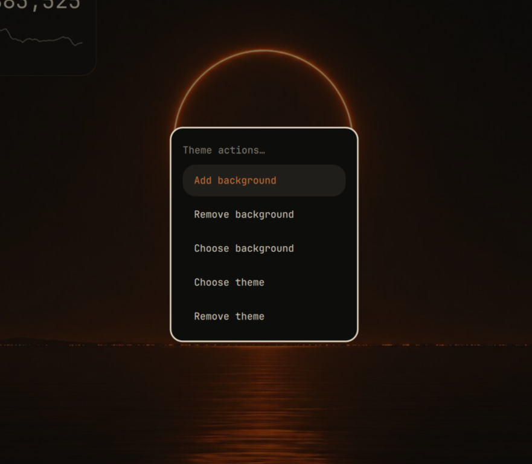

# Omarchy Theme And Background Widget

A top-bar widget for Omarchy with actions to:

- Add a background
- Remove a background
- Choose a background
- Choose a theme
- Remove a theme



## Install from GitHub

```bash
omarchy plugin add https://github.com/pappyholt6-sudo/omarchy-theme-and-background-widget.git --enable
omarchy bar put local.theme-picker --section right
omarchy restart shell
```

The widget appears as **Omarchy Theme And Background Widget** in the top bar.

## Install from a downloaded copy

From inside this repository, run:

```bash
./install.sh
omarchy bar put local.theme-picker --section right
omarchy restart shell
```

## Remove

```bash
omarchy plugin remove local.theme-picker
```
